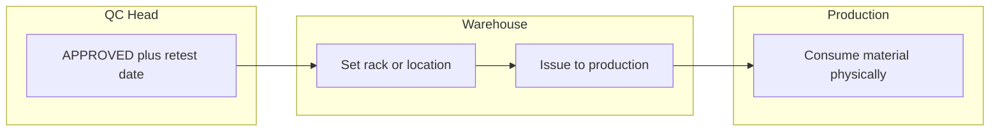

# Approved → shelf → production (RM flow focus)

## What is already in place (no change)

- **GRN + card creation**: Warehouse creates product cards with GRN number, batch number, supplier, quantity, pack type; system generates QR; product goes to **Quarantine**. ([backend/app/inventory/service.py](backend/app/inventory/service.py) `create_product`; [backend/app/inventory/router.py](backend/app/inventory/router.py) `create_product`.)
- **QC Executive**: Add A.R. number, withdraw samples, status → **UNDER TEST**. ([backend/app/qc/service.py](backend/app/qc/service.py) `add_ar_number`, `withdraw_sample`.)
- **QC Head**: Approve / Reject / (retest path). **Retest date mandatory on approval** — already enforced in `approve_material` (no date → 400). ([backend/app/qc/service.py](backend/app/qc/service.py) `approve_material`, `reject_material`.)
- **Scan shows AR + material details**: Backend returns `ar_number`, `retest_date`, `rack_number`, quantities in [resolve_scan_payload](backend/app/inventory/service.py); mobile [QRScannerScreen](mobile/src/screens/scanner/QRScannerScreen.tsx) shows AR Number, Retest Date, Rack no., Balance, etc.
- **Rejected**: Batches stay in REJECTED; issue to production is blocked (only APPROVED / ISSUED_TO_PRODUCTION can be issued).

---

## Target flow: approved → shelf → production (who does what)

| Step | Who | What (per doc) | Current implementation |
|------|-----|----------------|------------------------|
| **Approved material stored** | **Warehouse** | Move to shelf / bin; record location. | Warehouse sets **rack** via `PATCH /inventory/batches/{id}/rack` ([router](backend/app/inventory/router.py) line 135; [service](backend/app/inventory/service.py) `update_batch_rack`). Permission: `UPDATE_LOCATION`. Batch must be APPROVED. **location_id** is not changed on approval (stays quarantine); only **rack_number** is set. |
| **Issue to production** | **Warehouse** | Issue material when production needs it. | Warehouse calls `POST /inventory/issue-stock` ([router](backend/app/inventory/router.py) line 117; [service](backend/app/inventory/service.py) `issue_stock`). Permission: `ISSUE_STOCK`. First issue moves status **APPROVED → ISSUED_TO_PRODUCTION**; `remaining_quantity` reduced; optional `issued_to_product_name`, `issued_to_batch_ref`. Mobile: [IssueStockScreen](mobile/src/screens/warehouse/IssueStockScreen.tsx). |
| **Production user (RM)** | — | Doc: Production user is for **FG** (send FG to warehouse, shipper label). For **raw material**, warehouse issues; production consumes physically. No separate "production receives RM" in system. | Matches: no production receipt API for RM; issue is one-way warehouse → production. |

So: **approved batches** are "stored" by **warehouse** (rack number); **production** is **handled** by warehouse issuing stock; production user in the doc does not perform RM receipt in the app — only FG later.

---

## Gaps and planned work (RM only; QA skipped)

### 1. Stock visibility (doc section 6)

**Requirement:** Remaining quantity must be visible only at material stage **Approved** (not Quarantine / Under Test).

**Current:** [list_batches](backend/app/inventory/router.py) and [get_batch](backend/app/inventory/router.py) return `remaining_quantity` for all statuses. Mobile [BatchListScreen](mobile/src/screens/inventory/BatchListScreen.tsx), [BatchDetailScreen](mobile/src/screens/warehouse/BatchDetailScreen.tsx) show it for all.

**Plan:** Either (a) backend: return `remaining_quantity: null` (or omit) when status is not APPROVED / ISSUED_TO_PRODUCTION, or (b) frontend: show "—" or hide for Quarantine / Under Test. Prefer one place (API or UI) to avoid inconsistency.

---

### 2. Retest date = "immediate"

**Requirement:** For **immediate retest**, retest date should be **immediate** (e.g. same day).

**Current:** [approve_material](backend/app/qc/service.py) requires `retest_date`; no rule that it must be future. [initiate_retest](backend/app/qc/service.py) allows warehouse to move batch to QUARANTINE_RETEST; no check that "retest date has been reached" before initiating.

**Plan:** (a) Allow **retest_date = today** (or past) as valid on approval for "immediate retest" (no validation that retest_date > today). (b) Optionally: allow **initiate retest** when retest_date is today or past (or always allow; doc says "when retest date is reached" — so either allow same-day or add a "retest due" gate). One small validation/rule change in QC service.

---

### 3. Approved storage location (optional)

**Current:** On QC approval, [_update_batch_status](backend/app/qc/service.py) is called **without** `location_type`; batch **location_id** stays at Quarantine. Only **rack_number** is updated later by warehouse.

**Doc:** "Moved out of quarantine and placed into normal warehouse storage."

**Plan:** Optional enhancement: add location type e.g. `APPROVED_STORAGE` (or reuse a generic "WAREHOUSE" type), create that location in DB/seed, and in `approve_material` call `_update_batch_status(..., location_type="APPROVED_STORAGE")` so batch moves there on approval. If you prefer "shelf is just rack_number within same building," skip this.

---

### 4. Stock report (doc section 7)

**Requirement:** Report with material received date, GRN, A.R. number, **quantity in Quarantine**, **quantity Under Test**, **Approved quantity**, Rejected / Dispensed, **current stock balance**; filters: material name, batch number, A.R. number, status, date range.

**Current:** [get_stock_report](backend/app/inventory/service.py) returns one row per batch with single status, `remaining_quantity`, `ar_number`, etc. No per-stage quantity columns, no filters.

**Plan:** New or extended endpoint (and optional UI): aggregate or list batches with **stage breakdown** (qty per status or per movement type), plus query params for material, batch, AR, status, date range. May require aggregation by batch + status history or movement types.

---

### 5. Quarantine label (doc section 5)

**Requirement:** Drum/Bag/Box quantity (per unit); Pack size as standard definition (e.g. 160 x 25.00 kg).

**Current:** [generate_quarantine_label](backend/app/utils/pdf_generator.py) has Pack Size, Total Qty, etc.; no explicit "quantity per drum/bag/box" or "160 x 25" style pack size text.

**Plan:** Add fields (e.g. to batch or GRN/label payload): quantity per container (drum/bag/box), pack size string (e.g. "160 x 25.00 kg"). Pass into PDF generator and print on label.

---

### 6. Grade transfer (doc)

**Current:** [request_grade_transfer](backend/app/qc/service.py) (warehouse can request), [approve_grade_transfer](backend/app/qc/service.py) (QC changes material code). Batch stays APPROVED during pending transfer; no "BLOCKED – PENDING QC RELEASE" status.

**Plan (later):** If strict doc compliance needed, add a batch state or transfer state so that when a transfer is pending, batch is not considered "releasable" until QC approves (and optionally show "Blocked – Pending QC release" in UI). Audit already logs request and approval.

---

## QA / FG (explicitly out of scope for this plan)

- QA applies to **finished goods** only (doc sections 3 and 8). FG flow: production sends FG → QA verifies and approves → warehouse receives and dispatches. To be planned separately.

---

## Summary

| Item | Owner / action | Status |
|------|----------------|--------|
| GRN, cards, quarantine | Already done | Done |
| QC AR, under test, approve/reject, retest date mandatory | Already done | Done |
| Scan shows AR + details | Backend + mobile | Done |
| **Who stores approved** | **Warehouse** (sets rack) | Done (rack only) |
| **Who issues to production** | **Warehouse** (ISSUE_STOCK) | Done |
| Remaining qty only when Approved | API or UI mask | To do |
| Immediate retest (retest date = today) | QC service rule | To do |
| Optional approved location on approval | QC service + location seed | Optional |
| Stock report (stage + filters) | New/enhanced API + UI | Backlog |
| Quarantine label (per-unit qty + pack text) | Data + PDF | Backlog |
| Grade transfer BLOCKED state | Optional state machine | Backlog |
| FG / QA | Later | Skipped |
