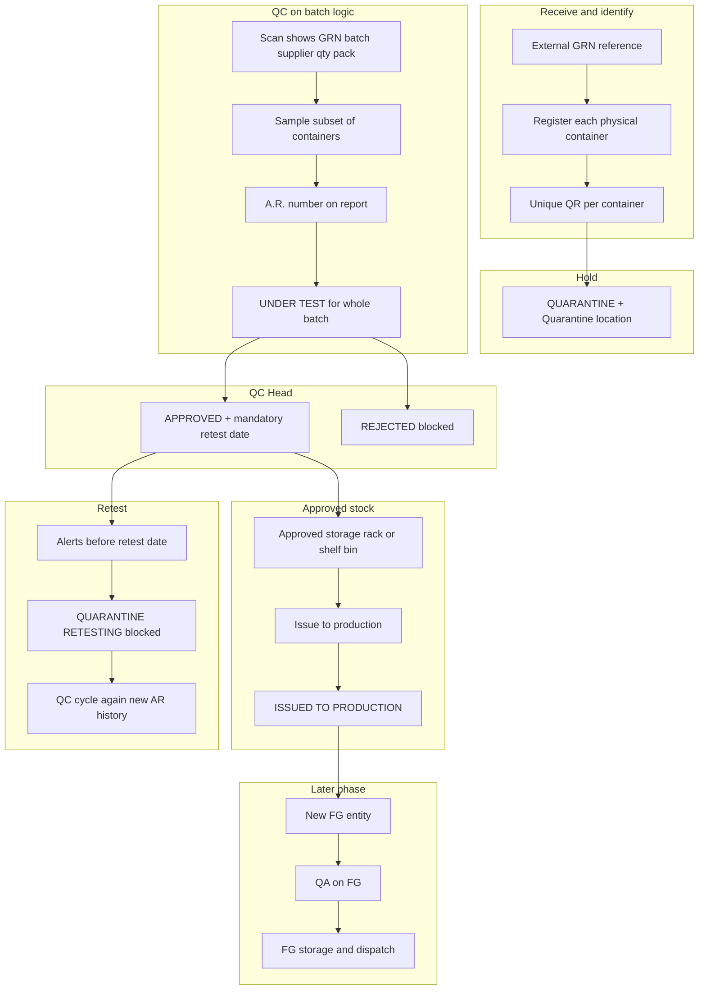

# End-to-end lifecycle alignment (knowledge + phased plan)

## Target story (what you and the client agree on)

This is the **reference flow** to “complete knowledge” before building more files.

**Concepts to keep crisp**

| Idea                | Meaning                                                                                                           |
| ------------------- | ----------------------------------------------------------------------------------------------------------------- |
| **Batch**           | Logical lot (same material, supplier context, one QC decision for “the lot”).                                     |
| **Container / box** | Physical unit; may have **its own QR** and quantity; QC still samples the **batch**, not every box.               |
| **QC vs QA**        | QC = raw material path; QA = **finished goods** path (separate entity after manufacturing).                       |
| **Retest**          | Time-based re-validation; **same batch**, new QC cycle, **full audit**, usage blocked while in retest quarantine. |
| **Grade transfer**  | After testing, **QC-authorised** code/grade change; traceability preserved.                                       |

---

## Important gap: narrative vs current data model

Your narrative assumes **many physical boxes → each gets a form + unique QR**, linked to **GRN ref + batch + supplier + qty in that box + pack type**.

Today’s backend is **batch-centric**: one row in `[batches](backend/app/models/inventory_models.py)` with one `qr_code_path`, one `remaining_quantity`, and `[grn](backend/app/models/inventory_models.py)` tied 1:1 to `batch_id`. There is **no** `container` / `box` table with per-box QR.

**So “from now on” you choose one of:**

1. **Model A — Match narrative (recommended if client insists on per-box QR)**
   Introduce **container** (or `batch_unit`) records: parent `Batch`, children each with `quantity`, `pack_type`, `qr_code_path`, `location_id`, and rules for **issue** (which boxes deducted) and **scan** (resolve container → batch → show AR).
2. **Model B — Simplified story**
   Keep **one QR per batch**; “register each box” becomes **repeated receipts** or **line items** that **roll up** to one batch (weaker traceability per physical box).

Until that choice is explicit, “shelf, move to production, AR on scan” can be implemented at **batch** level (already close) but **not** per-box without Model A.

---

## Phased work (your stated priority: RM + production + shelf + AR; FG/QA later)

### Phase 1 — Lock the **RM** story in docs and UI copy

- One page (internal wiki or `docs/LIFECYCLE.md`) with the diagram above + definitions (batch vs container, external GRN ref).
- List **enforcement rules**: retest mandatory on approve; reject = no issue; retest = block issue; grade change = QC only.

### Phase 2 — **Warehouse / registration** (align with chosen model)

- **External GRN**: decide if the system stores `grn_number` as **reference only** (no internal “create GRN” as primary) vs current “create batch + GRN together” in `[inventory/service.py](backend/app/inventory/service.py)`.
- **Per-box registration**: if Model A, new API + tables + migrations; labels print per container.
- **Quarantine label**: narrative wants **qty per container** + **pack size** text (e.g. `160 x 25 kg`); extend data + `[pdf_generator.py](backend/app/utils/pdf_generator.py)` accordingly.

### Phase 3 — **QC scan experience**

- Scanner response must always show **GRN ref, batch, supplier, pack, quantities, A.R. when exists, retest date when approved** (narrative requirement). Backend pieces exist in `[resolve_scan_payload](backend/app/inventory/service.py)`; confirm **mobile** shows all fields.

### Phase 4 — **Approved storage + issue**

- **Rack / shelf / bin**: narrative = structured location; you have `rack_number` + `location_id` — decide if “bin” needs another field or location hierarchy.
- **Production request vs warehouse issue**: narrative says production **requests**, warehouse **issues**; align **permissions** (who can call issue API) and optional **request** workflow if not present.

### Phase 5 — **Retest + alerts**

- Alerts to **QC + warehouse** near retest date (scheduler + notifications + in-app banner).
- Status **QUARANTINE (RETESTING)**, block issue, **new label** + new QR if required per container (heavier if Model A).

### Phase 6 — **Grade-to-grade**

- Narrative: warehouse **request** → **blocked pending QC** → QC **release** and code change. Today: `[request_grade_transfer` / `approve_grade_transfer](backend/app/qc/service.py)` without a dedicated **batch BLOCKED** state — plan a small state machine extension if you want strict doc compliance.

### Phase 7 — **FG / QA** (later, as you said)

- FG entity, production handoff, QA inspect/approve, warehouse receive, dispatch — separate from RM lifecycle; only **conceptually** fed by consumed approved RM.

### Cross-cutting — **Audit**

- Narrative: **non-editable** audit. You already log actions; plan “append-only + no update API on audit rows” as a policy review, not necessarily new files.

---

## What you can “confirm from now on” without coding

1. **FG is not “the approved RM batch”** — it is **output** of production; QA is **not** a continuation of QC on the same record.
2. **AR applies to the batch (lot)**; physical tracking can still be per-box if you add Model A.
3. **Retest date** is part of **approval**, not optional.
4. **Order of build**: finish **RM + warehouse + QC + issue + retest (+ grade)** before investing in **FG/QA** depth.

---

## Single decision to unblock detailed design

Before adding “a few more files,” decide **Model A (per-box QR + container table)** vs **Model B (batch-level QR only)**. That choice drives migrations, APIs, issue logic, and label printing for everything above.
