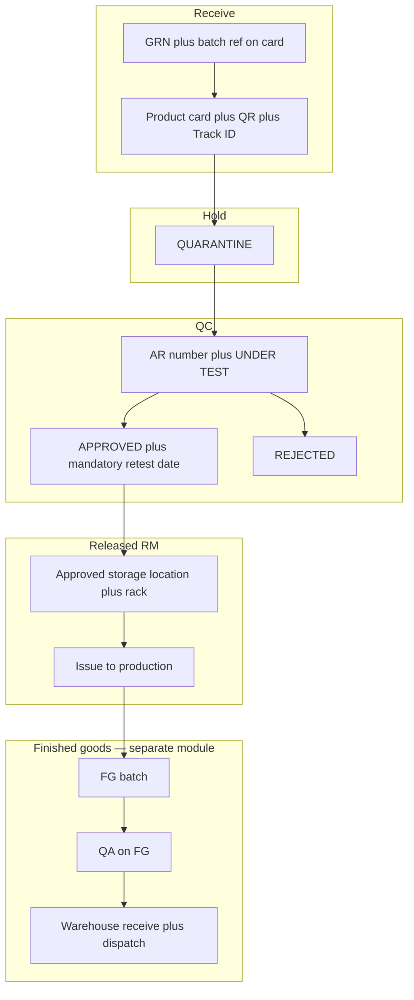

# QTrack — Raw material & FG lifecycle (internal reference)

This document aligns the team and client on **batch vs container**, **QC vs QA**, and **enforcement rules**. It matches the phased delivery plan for the WMS.

## Decision: tracking model (Model B)

**We use Model B — batch-centric tracking.**

- Each **product card** creates one **batch** with one **GRN** row, one **QR**, and a **public Track ID** (`#` + 8 characters).
- Physical “100 boxes” are represented as **one batch** with **total quantity** and **per-container quantity** (`pack_size`) plus **pack type**, not as 100 separate DB rows with 100 QRs.
- If the client later requires **one QR per physical box**, that would be **Model A** (new `batch_container` table and issue logic) — out of scope unless formally re-scoped.

## End-to-end flow (reference)

## Concepts

| Term | Meaning |
|------|--------|
| **Batch** | Logical lot: material, supplier context, QC decision applies to the whole lot. |
| **GRN** | Goods receipt reference stored in-system and linked to the batch (may mirror an external GRN number). |
| **Track ID** | Short public code (`#` + 8 chars) plus QR payload for alternate lookup. |
| **QC** | Raw material path: quarantine → under test → approved/rejected/retest. |
| **QA** | Finished goods only — separate `finished_goods_batches` lifecycle. |

## Enforcement rules (system behaviour)

1. **Retest date** is **mandatory** on QC Head **approval** (cannot approve without it).
2. **Rejected** batches **cannot** be issued to production.
3. **Quarantine (retesting)** batches **cannot** be issued to production.
4. **Pending code-to-code (grade) transfer** — batch **cannot** be issued** until QC approves the transfer.
5. **Grade / material code change** — only **QC** (approve grade transfer), not warehouse.
6. **Audit** — status and compliance actions are logged; treat audit as **append-only** in operations (no user editing of history).

## Locations (seed)

- `QUARANTINE` — initial receipt and retest quarantine.
- `TESTING` — under test (QC lab).
- `APPROVED` — approved storage (batch moves here on QC approval when location is configured).
- `PRODUCTION`, `FG_STORAGE`, `DISPATCH`, etc. — downstream.

## Related docs

- [FG_QA_ROADMAP.md](./FG_QA_ROADMAP.md) — finished goods / QA follow-up scope.

## Existing deployments (ops)

- After pulling changes, run **Alembic** (`alembic upgrade head`) for new columns (e.g. `pack_size_description`).
- **Warehouse users** need permission **`REQUEST_GRADE_TRANSFER`** for code-to-code requests: re-run `seed.py` or attach that permission to the role in the DB (seed file was updated for new installs).
